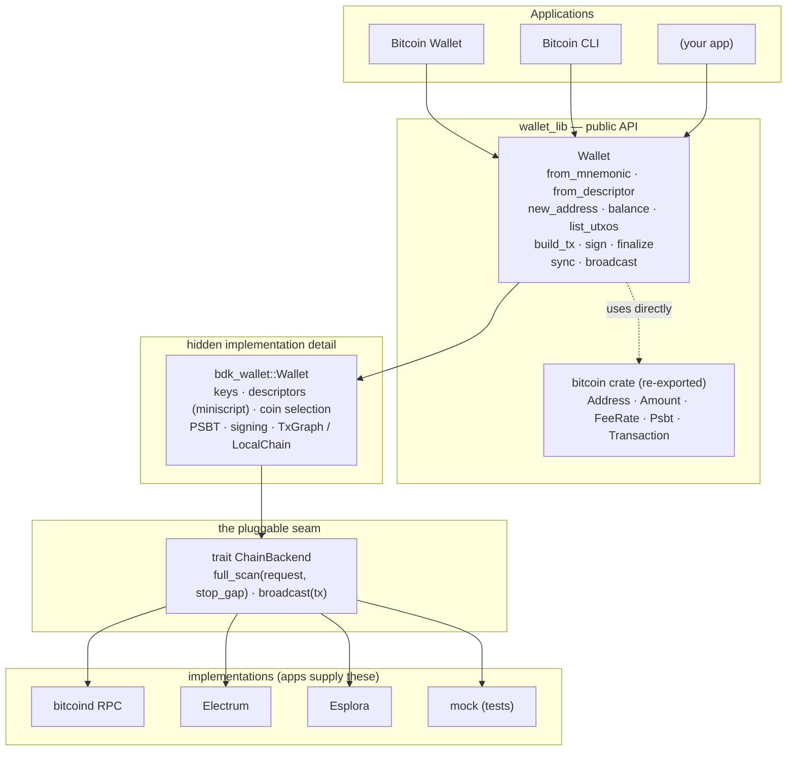

# Wallet Library
A reusable Rust crate that provides wallet functionality through a clean API for other developers to build on. This wraps bdk_wallet 
internally, but never leaks it: the wallet engine is a private implementation detail, the chain data source is a trait an application plugs in, and the only Bitcoin-specific types in the public API are the foundational ones (bitcoin::Address, Amount, Psbt, ...) that any caller needs regardless of what sits underneath.

``cargo test``

# Runnable Examples

Everything below is a real, compiling, runnable program in examples/. None of them touch a network: a small fake chain (examples/common/mod.rs, a ChainBackend built out of the public API only) plays the part of a node, so 
``cargo run --example <name>`` just works.


| Example | What it shows |
| --- | --- |
| `quickstart` | The whole lifecycle in one `main`: create from mnemonic, derive addresses, sync, read balance and UTXOs, build → sign → finalize → broadcast, and watch the balance move as the payment and your own transaction confirm. |

```
cargo run --example quickstart
```

## Architecture




## Project layout

```
src/
  lib.rs      crate docs + public re-exports
  wallet.rs   the Wallet type (construction, addresses, balance, UTXOs,
              build_tx, sign, finalize, sync, broadcast) + unit tests
  backend.rs  the ChainBackend trait and its bdk_chain re-exports
  types.rs    AddressInfo, Balance, Utxo, Recipient, Keychain,
              ConfirmationStatus
  error.rs    WalletError
tests/
  chain_backend.rs   black-box integration test: a mock ChainBackend and a
                     full sync → build → sign → finalize round trip
examples/
  quickstart.rs      end-to-end lifecycle against a fake chain
  common/mod.rs      the fake ChainBackend all three share
```

## Quick start

```rust
use wallet_lib::{Network, Wallet};

let mnemonic = wallet_lib::Mnemonic::parse(
    "abandon abandon abandon abandon abandon abandon abandon abandon abandon abandon abandon about",
)?;
let mut wallet = Wallet::from_mnemonic(&mnemonic, None, Network::Signet)?;

let address = wallet.new_address();
println!("send funds to: {address}");
```

A wallet can also be built from an explicit descriptor pair instead of a
mnemonic:

```rust
let mut wallet = Wallet::from_descriptor(
    "wpkh([fingerprint/84'/0'/0']xpub.../0/*)",
    Some("wpkh([fingerprint/84'/0'/0']xpub.../1/*)"), // change descriptor
    Network::Bitcoin,
)?;
```

## Implementing a `ChainBackend`

```rust
use wallet_lib::backend::{ChainBackend, FullScanRequest, FullScanResponse, KeychainKind};

struct MyBackend { /* an RPC client, an Electrum connection, ... */ }

impl ChainBackend for MyBackend {
    type Error = MyBackendError;

    fn full_scan(
        &self,
        request: FullScanRequest<KeychainKind>,
        stop_gap: usize,
    ) -> Result<FullScanResponse<KeychainKind>, Self::Error> {
        // Fetch every requested script pubkey for each keychain, deriving
        // further ones until `stop_gap` consecutive addresses come back
        // with no history. Return everything found as a FullScanResponse.
        todo!()
    }

    fn broadcast(&self, tx: &bitcoin::Transaction) -> Result<(), Self::Error> {
        todo!()
    }
}
```

`wallet_lib::backend` re-exports every `bdk_chain` type a backend needs to
construct a response (`TxUpdate`, `CheckPoint`, `BlockId`,
`ConfirmationBlockTime`), so an implementation only needs `wallet_lib` as a
dependency, not `bdk_wallet` directly. See
[`tests/chain_backend.rs`](tests/chain_backend.rs) for a complete, working
mock implementation and an end-to-end sync → build → sign → finalize test.

`full_scan` was chosen as the only required method (over a cheaper
incremental sync) because it's a strict superset of what incremental
syncing accomplishes and is correct even for a freshly-restored wallet
whose used addresses aren't known yet — see the doc comment on
`ChainBackend` in [`src/backend.rs`](src/backend.rs) for the full
reasoning, including how a backend can still implement a cheaper path
internally.